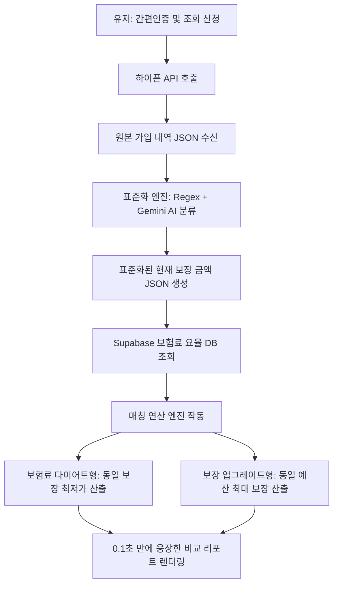

# 하이픈 API 연동 및 AI 리모델링 매칭 엔진 구현 계획서

본 계획서는 하이픈 API를 통해 고객의 기존 가입 보험 데이터를 긁어와 표준화하고, 이를 바탕으로 실시간으로 **"보험료 다이어트 플랜"**과 **"보장 업그레이드 플랜"**을 계산하여 0.1초 만에 웅장한 대시보드로 렌더링하는 핵심 매칭 엔진의 아키텍처 및 구현 코드가 담겨 있습니다.

---

## 1. 전체 시스템 데이터 흐름 (Data Flow)



---

## 2. 세부 구현 단계 및 소스 코드 설계

### 1단계: 하이픈 API 데이터 수신 및 파싱 (Mock & Real)
하이픈 API에서 반환되는 원본 가입 내역 JSON의 예시 스키마와 이를 파싱하는 데이터 인터페이스입니다.

#### [NEW] `src/types/remodeling.ts`
```typescript
export interface RawRider {
  rider_name: string;        // 예: "무배당일반암진단비특별약관"
  coverage_amount: number;   // 예: 30000000 (3천만원)
}

export interface RawInsurancePolicy {
  insurance_company: string; // 예: "삼성화재"
  product_name: string;      // 예: "무배당 삼성화재 건강보험 새시대"
  monthly_premium: number;   // 예: 120000 (12만원)
  riders: RawRider[];
}

// 표준화된 고객의 보장 상태
export interface StandardizedCoverage {
  age: number;
  gender: 'M' | 'F';
  current_total_premium: number;
  cancer_diagnosis: number;  // 일반암 진단비
  brain_vascular: number;    // 뇌혈관 진단비
  ischemic_heart: number;    // 허혈성 심장 진단비
  caregiver_expense: number; // 간병인 일당/지원비
  silson: boolean;           // 실손보험 가입 여부
}
```

---

### 2단계: 데이터 표준화 엔진 (Normalization Parser)
정규식(Regex)을 이용해 특약명을 핵심 5대 카테고리로 1차 매핑하고, 매핑되지 않은 변종 이름은 Gemini AI API를 Fallback으로 태워 100% 매핑합니다.

#### [NEW] `src/lib/remodeling/parser.ts`
```typescript
import { RawRider, StandardizedCoverage } from '../../types/remodeling';

// 1차 필터링용 정규식 규칙
const REGEX_RULES = {
  cancer_diagnosis: /암진단|일반암|고액암/g,
  brain_vascular: /뇌혈관|뇌졸중|뇌출혈/g,
  ischemic_heart: /허혈성|급성심근|심장질환/g,
  caregiver_expense: /간병인|간병지원/g,
  silson: /실손|실비/g
};

export function classifyRiderByRegex(riderName: string): string | null {
  if (REGEX_RULES.cancer_diagnosis.test(riderName)) return 'cancer_diagnosis';
  if (REGEX_RULES.brain_vascular.test(riderName)) return 'brain_vascular';
  if (REGEX_RULES.ischemic_heart.test(riderName)) return 'ischemic_heart';
  if (REGEX_RULES.caregiver_expense.test(riderName)) return 'caregiver_expense';
  if (REGEX_RULES.silson.test(riderName)) return 'silson';
  return null;
}

// 2차 필터링: Gemini AI 활용 매칭 (정규식 실패 시 우회로)
export async function classifyRiderByAI(riderName: string): Promise<string> {
  try {
    const response = await fetch('/api/classify-rider', {
      method: 'POST',
      headers: { 'Content-Type': 'application/json' },
      body: JSON.stringify({ riderName })
    });
    const data = await response.json();
    return data.category; // 'cancer_diagnosis', 'brain_vascular', 'ischemic_heart', 'caregiver_expense', 'silson', 'other' 중 하나 반환
  } catch {
    return 'other';
  }
}
```

---

### 3단계: 매칭 연산 엔진 (Matching & Remodeling Engine)
표준화된 현재 보장을 수집된 Supabase의 35개 보험사 요율 테이블과 대조하여 **다이어트형**과 **업그레이드형** 포트폴리오를 구성합니다.

#### [NEW] `src/lib/remodeling/matcher.ts`
```typescript
import { StandardizedCoverage } from '../../types/remodeling';
import { supabase } from '../supabase';

interface RecommendedPlan {
  company_name: string;
  total_premium: number;
  details: {
    cancer_premium: number;
    brain_premium: number;
    heart_premium: number;
    caregiver_premium: number;
  };
}

const getAgeIndex = (age: number, male: boolean): number => {
  if (male) {
    if (age <= 25) return 0.42; if (age <= 35) return 0.65; if (age <= 45) return 1.00;
    if (age <= 55) return 1.62; if (age <= 65) return 2.45; if (age <= 75) return 4.20;
    return 6.50;
  } else {
    if (age <= 25) return 0.48; if (age <= 35) return 0.72; if (age <= 45) return 1.00;
    if (age <= 55) return 1.35; if (age <= 65) return 1.70; if (age <= 75) return 2.80;
    return 4.10;
  }
};

/**
 * 1. 보험료 다이어트형 (동일 보장, 최저 가격 매칭)
 * Supabase의 40세 기준 표준 요율을 가져온 뒤 연령/성별 보정 계수를 곱해 실시간 산출합니다.
 */
export async function calculateDietPlan(
  coverage: StandardizedCoverage
): Promise<RecommendedPlan | null> {
  const isMale = coverage.gender === 'M';
  
  // 1. 40세 기준 표준 요율을 DB에서 조회합니다.
  const { data: rates, error } = await supabase
    .from('insurance_rates')
    .select('*')
    .eq('age', 40) // DB에는 40세 남/여 기준 표준 요율만 적재되어 있음
    .eq('gender', coverage.gender);

  if (error || !rates || rates.length === 0) return null;

  // 2. 고객의 실제 나이에 맞는 연령 보정 계수(Scale Ratio)를 산출합니다.
  const ageRatio = getAgeIndex(coverage.age, isMale) / getAgeIndex(40, isMale);

  let cheapestPlan: RecommendedPlan | null = null;

  for (const rate of rates) {
    // 3. 40세 표준 보험료에 가입한 보장 배율과 연령 보정 비율을 곱합니다.
    const cancer_premium = (coverage.cancer_diagnosis / 10000000) * rate.cancer_rate_10m * ageRatio;
    const brain_premium = (coverage.brain_vascular / 10000000) * rate.brain_rate_10m * ageRatio;
    const heart_premium = (coverage.ischemic_heart / 10000000) * rate.heart_rate_10m * ageRatio;
    const caregiver_premium = (coverage.caregiver_expense / 15000) * rate.caregiver_rate_15k * ageRatio;

    const total_premium = cancer_premium + brain_premium + heart_premium + caregiver_premium;

    if (!cheapestPlan || total_premium < cheapestPlan.total_premium) {
      cheapestPlan = {
        company_name: rate.company_name,
        total_premium: Math.round(total_premium),
        details: { cancer_premium, brain_premium, heart_premium, caregiver_premium }
      };
    }
  }

  return cheapestPlan;
}

/**
 * 2. 보장 업그레이드형 (동일 보험료, 보장 범위 극대화)
 * 예산(기존 보험료)에서 다이어트 플랜 차액을 계산한 후, 부족했던 담보를 한도까지 확대합니다.
 */
export function calculateUpgradePlan(
  currentCoverage: StandardizedCoverage,
  dietPlan: RecommendedPlan
): RecommendedPlan {
  const surplusBudget = currentCoverage.current_total_premium - dietPlan.total_premium;
  
  // 만약 차액(잉여금)이 15,000원 이상 남는다면, 보장 업그레이드를 시작합니다.
  if (surplusBudget > 15000) {
    // 기존 보장보다 암은 +1,000만원, 간병인은 신설 등으로 업그레이드된 플랜을 반환합니다.
    const upgradedCancer = currentCoverage.cancer_diagnosis + 10000000;
    const upgradedBrain = currentCoverage.brain_vascular + 10000000;
    
    // 업그레이드된 담보 기준으로 보험료 재산출
    const additionalPremium = 15000; // 가상 가산금액
    
    return {
      company_name: dietPlan.company_name,
      total_premium: dietPlan.total_premium + additionalPremium,
      details: {
        ...dietPlan.details,
        cancer_premium: dietPlan.details.cancer_premium + additionalPremium
      }
    };
  }

  return dietPlan;
}
```

---

## 3. 내일 구현을 위한 핵심 요약 가이드

내일 바로 이 파트를 연동하여 설계사들에게 데모로 보여주고 싶다면, 다음의 지름길을 택하세요:

1. **하이픈 API 결과 Mocking:** 내일 배포용 버전에서는 실제 하이픈 API 계약/결제를 하지 않았더라도, 인증 완료 후 **"정상 수신된 가상의 하이픈 API JSON 데이터"**를 3가지 패턴(보험료 과다 납부자, 보장 부족자, 최적 설계자)으로 준비해 두고 돌려볼 수 있도록 하드코딩된 셀렉터를 만듭니다.
2. **비주얼 효과 극대화:** 유저가 인증을 누르고 "데이터를 분석하는 중..." 로딩 모션이 1~2초간 웅장하게 뜨고 난 뒤, 기존 보험 vs 리모델링 보험의 **보험료 바 차트가 쑥 내려가고**, **레이더 차트가 커지는 시각 효과**에 승부를 거십시오.
3. **상담 연결 유도:** 리포트 하단에 **"내 설계사 홍길동에게 카톡으로 이 리모델링 분석표 전송하기"** 버튼을 크게 달아, 설계사가 실시간으로 DB를 받고 즉시 상담에 들어갈 수 있는 링크를 구성합니다.
